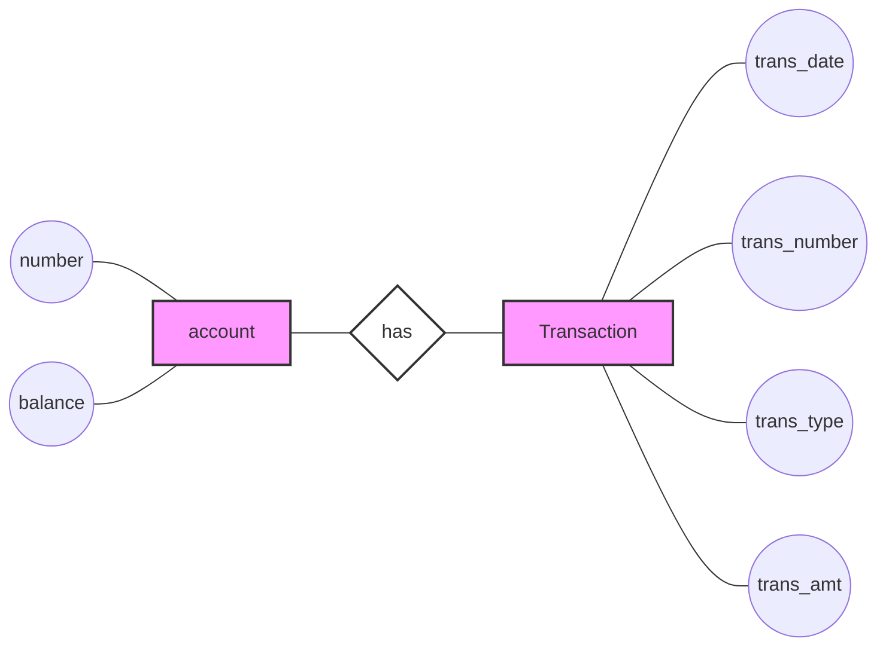
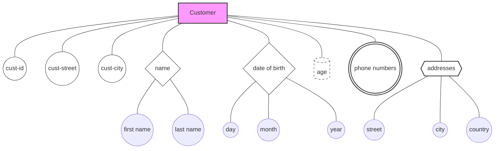
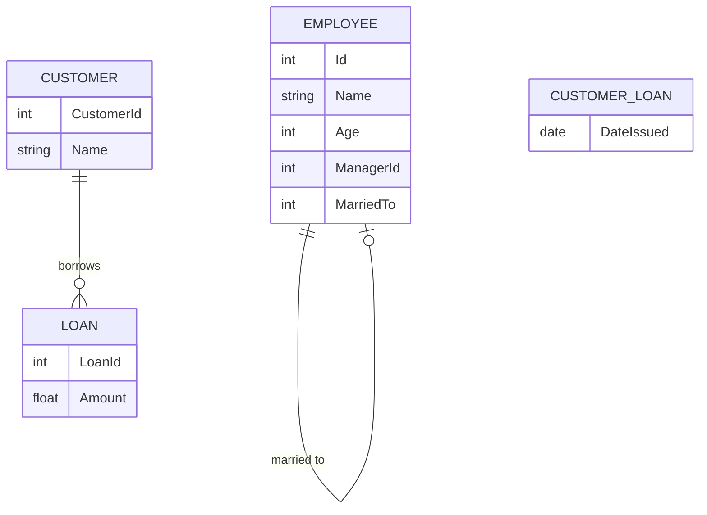
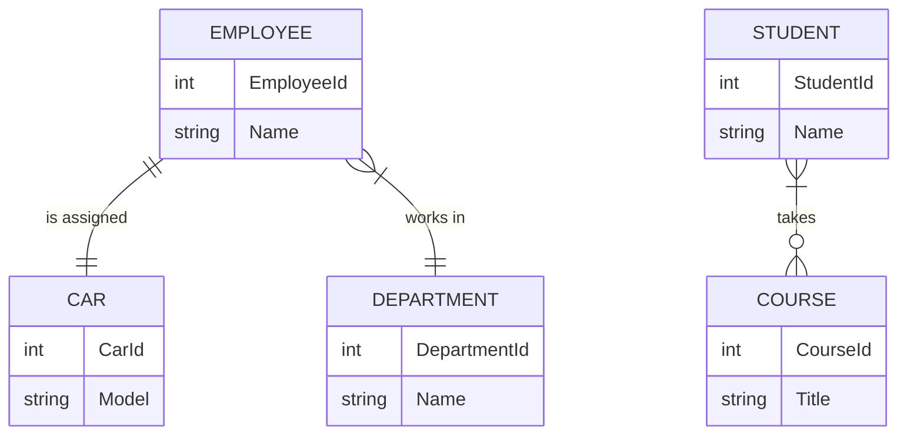
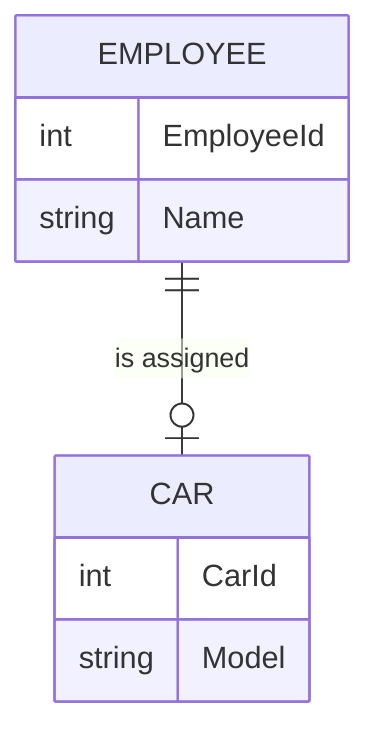

# Entity Types in ERDs: Strong and Weak Entities

In Entity Relationship Diagrams (ERDs), entities can be classified into two main types: strong entities and weak entities. Understanding the difference between these types is crucial for effective database design.

## Strong Entities

### Definition
A strong entity is an entity whose existence does not depend on the existence of any other entity in the system.

### Characteristics
- Can be uniquely identified by its own attributes
- Exists independently of other entities

### Visual Representation
- Single rectangle in ERD

## Weak Entities

### Definition
A weak entity is an entity whose existence depends on the existence of another entity (called the owner or parent entity) in the system.

### Characteristics
- Cannot be uniquely identified by its own attributes alone
- Requires the attributes of its owner entity for unique identification
- Its existence is contingent on the existence of the owner entity

### Visual Representation
- Double rectangle in ERD

## Relationship Between Strong and Weak Entities

### Identifying Relationship
The relationship between a weak entity and its owner (strong) entity is called an identifying relationship.

### Visual Representation
- Double diamond in ERD

## Visual Representation

Here's a visual representation using Chen notation style:

In this diagram:
- Rectangles represent entities ("account" and "Transaction")
- Ovals (approximated by circles) represent attributes
- A diamond shape represents the relationship ("has")

Note: In a full ERD:
- Strong entities would be single rectangles (as shown)
- Weak entities would be double rectangles
- Identifying relationships would be double diamonds
- Primary key attributes would be underlined

## Key Points

1. Strong entities exist independently in the system.
2. Weak entities depend on strong entities for their existence.
3. The relationship between a weak entity and its parent strong entity is an identifying relationship.
4. In ERDs, strong entities are represented by single rectangles, weak entities by double rectangles, and identifying relationships by double diamonds.

## Importance in Database Design

- Understanding entity types helps in properly structuring the database.
- It ensures that dependencies between data are correctly modeled.
- Helps in maintaining data integrity and enforcing proper constraints in the database system.

---

*Note: The visual representation in actual ERD tools may differ slightly from the mermaid diagram shown here, particularly in the representation of weak entities and identifying relationships.*

# Attribute Types in Entity-Relationship Diagrams

In Entity-Relationship Diagrams (ERDs), attributes represent the properties or characteristics of entities. Understanding different types of attributes is crucial for effective database design.

## Types of Attributes

### 1. Simple Attributes
- Definition: Basic, indivisible attributes
- Representation: Single ellipse
- Examples:
  - For Customer entity: cust-id, cust-street, cust-city
  - For Account entity: number, balance

### 2. Composite Attributes
- Definition: Attributes composed of multiple simple attributes
- Representation: Ellipse with connected sub-ellipses
- Examples:
  - Customer name (composed of first name and last name)
  - Date of birth (composed of day, month, year)

### 3. Derived Attributes
- Definition: Attributes whose values can be calculated from other attributes
- Representation: Dashed ellipse
- Examples:
  - Age (calculated from date of birth)
  - Net salary (calculated from salary and deductions)
- Note: Derived attributes are typically not stored in the database to save space. They are handled in application code.
- Trade-off: For complex calculations, it might be more efficient to store the result as a simple attribute to save processing time.

### 4. Multi-valued Attributes
- Definition: Attributes that can have multiple values for a single entity
- Representation: Double ellipse
- Examples:
  - Customer phone numbers
  - Customer addresses

### 5. Complex Attributes
- Definition: A combination of multi-valued and composite attributes
- Representation: Double ellipse with connected sub-ellipses
- Example: Customer addresses, where each address consists of street, city, and country

## Visual Representation

In this diagram:
- Simple attributes: cust-id, cust-street, cust-city
- Composite attributes: name, date of birth
- Derived attribute: age (dashed ellipse)
- Multi-valued attribute: phone numbers (double ellipse)
- Complex attribute: addresses (double ellipse with sub-attributes)

## Considerations in Database Design

1. **Storage Efficiency**: 
   - Simple attributes are straightforward to store
   - Derived attributes often aren't stored to save space
   - Complex attributes may require careful structuring (e.g., separate tables)

2. **Query Performance**: 
   - Simple and stored composite attributes allow for quick queries
   - Derived attributes may require calculation time if not stored

3. **Data Integrity**: 
   - Properly defined attributes help maintain data consistency
   - Multi-valued attributes often necessitate separate tables to maintain normalization

4. **Flexibility**: 
   - Complex and multi-valued attributes provide flexibility for varying data requirements

5. **Trade-offs**: 
   - Consider the balance between storage space and computation time
   - For complex calculations, storing the result as a simple attribute might be more efficient

## Best Practices

1. Use simple attributes when possible for straightforward data storage and retrieval
2. Implement composite attributes when there's a logical grouping of data
3. Carefully consider whether to store or calculate derived attributes based on usage frequency and complexity
4. Normalize multi-valued and complex attributes to maintain data integrity
5. Document the rationale behind attribute choices, especially for derived and complex attributes

---

*Note: The visual representation and implementation of attributes may vary depending on the specific ERD notation and database management system being used.*

# Relationships in Entity-Relationship Diagrams

Relationships in Entity-Relationship Diagrams (ERDs) represent the associations between entities. They are crucial for understanding how different data elements interact within a database system.

## Types of Relationships

Relationships can be classified based on the number of entities involved:

1. **Unary (Recursive) Relationships**
2. **Binary Relationships**
3. **Ternary Relationships**

## Degree of Relationship

The degree of a relationship refers to the number of entities participating in that relationship. It's a crucial concept in understanding how data is related in a database system.

### 1. Unary (Recursive) Relationships

- **Degree**: One
- **Definition**: A relationship between instances of the same entity type.
- **Representation**: A relationship line that connects an entity to itself.
- **Examples**: 
  1. Employee management hierarchy
  2. Employee marriages within a company

#### Example: Employee Management Hierarchy

Consider the following Employee table:

| Id | Name  | Age | ManagerId | MarriedTo |
|----|-------|-----|-----------|-----------|
| 1  | Ahmed | 43  | NULL      | 2         |
| 2  | Aya   | 37  | 1         | 1         |
| 3  | Omar  | 36  | 1         | NULL      |
| 4  | Mona  | 32  | 2         | NULL      |

In this example:
- The "Manage" relationship is unary, connecting the Employee entity to itself through the ManagerId.
- The "MarriedTo" relationship is also unary, representing marriages between employees.

### 2. Binary Relationships

- **Degree**: Two
- **Definition**: A relationship between two different entity types.
- **Example**: "Customer" borrows "Loan"

### 3. Ternary Relationships

- **Degree**: Three
- **Definition**: A relationship involving three entity types.
- **Note**: Less common but sometimes necessary to accurately represent complex relationships.

## Visual Representation

In this updated diagram:
- The "manages" relationship on EMPLOYEE demonstrates a unary relationship for the management hierarchy.
- The "married to" relationship on EMPLOYEE shows another unary relationship for employee marriages.
- The "borrows" relationship between CUSTOMER and LOAN shows a binary relationship.
- CUSTOMER_LOAN represents the relationship attributes (like DateIssued) that exist only when the relationship occurs.

## Key Points

1. The degree of a relationship is determined by the number of participating entities.
2. Unary relationships (degree one) connect an entity to itself, often representing hierarchies or self-referential data.
3. Binary relationships (degree two) are the most common, connecting two different entity types.
4. Ternary relationships (degree three) involve three entities and are used for more complex associations.
5. Understanding the degree of relationships is crucial for proper database design and query optimization.

## Considerations in Database Design

1. **Flexibility**: Unary relationships can represent complex hierarchies or networks within a single entity type.
2. **Data Integrity**: Proper relationship modeling ensures referential integrity in the database.
3. **Query Complexity**: More complex relationships (like ternary) may require more sophisticated queries.
4. **Normalization**: Consider how relationships affect database normalization, especially with relationship attributes.

---

*Note: The implementation of relationships in actual databases may vary depending on the specific database management system and the requirements of the application.*

[Previous content remains unchanged]

## Cardinality Constraints

Cardinality constraints define how many instances of one entity can be associated with instances of another entity in a relationship. These constraints are crucial for accurately representing the business rules in a data model.

### Types of Cardinality Constraints

1. **One-to-One (1:1)**
2. **One-to-Many (1:N)**
3. **Many-to-Many (M:N)**

#### 1. One-to-One (1:1)
- Definition: One instance of an entity is associated with exactly one instance of another entity.
- Example: One employee has one car (assuming company policy allows only one company car per employee).

#### 2. One-to-Many (1:N)
- Definition: One instance of an entity is associated with multiple instances of another entity.
- Example: One department has many employees.

#### 3. Many-to-Many (M:N)
- Definition: Multiple instances of an entity are associated with multiple instances of another entity.
- Example: Many students take many courses.

### Examples

1. **Student and Course (Many-to-Many)**
   - One student takes many courses.
   - One course is taken by many students.
   - Combined: Many-to-Many relationship.

2. **Employee and Department (Many-to-One)**
   - One employee works in one department.
   - One department has many employees.
   - Combined: Many-to-One relationship (from Employee to Department).

3. **Employee and Car (One-to-One)**
   - One employee has one company car.
   - One company car is assigned to one employee.

## Visual Representation

In this diagram:
- The "is assigned" relationship between EMPLOYEE and CAR shows a one-to-one relationship.
- The "works in" relationship between EMPLOYEE and DEPARTMENT shows a many-to-one relationship.
- The "takes" relationship between STUDENT and COURSE shows a many-to-many relationship.

## Key Points

1. Cardinality constraints define the number of instances that can participate in a relationship.
2. One-to-One relationships connect single instances of two entities.
3. One-to-Many relationships allow one instance of an entity to be associated with multiple instances of another entity.
4. Many-to-Many relationships allow multiple instances on both sides of the relationship.
5. Understanding cardinality is crucial for properly modeling business rules and designing efficient database structures.

## Considerations in Database Design

1. **Data Integrity**: Cardinality constraints help enforce data integrity rules in the database.
2. **Table Structure**: The cardinality of relationships often influences how tables are structured and related in the physical database design.
3. **Performance**: Different cardinalities may require different indexing strategies for optimal query performance.
4. **Flexibility**: Consider future requirements when defining cardinalities, as changing them later can be challenging.

## Participation Constraints

Participation constraints specify whether all instances of an entity must participate in a relationship. This concept is crucial for accurately representing business rules and data integrity in a data model.

### Types of Participation Constraints

1. **Total Participation (mandatory participation)**
2. **Partial Participation (optional participation)**

#### 1. Total Participation
- Definition: All instances of the entity must participate in the relationship.
- Representation: Usually shown with a double line connecting the entity to the relationship.
- Example: All cars must be assigned to a particular employee (in a company car scenario).

#### 2. Partial Participation
- Definition: Not all instances of the entity need to participate in the relationship.
- Representation: Usually shown with a single line connecting the entity to the relationship.
- Example: An employee may have a company car (but it's not mandatory for all employees).

### Example Scenario

Let's consider the relationship between Employees and Company Cars:

1. **Employee to Car (Partial Participation)**
   - An employee may have a company car, but not all employees do.
   - Represented by a single line from Employee to the relationship.

2. **Car to Employee (Total Participation)**
   - Every company car must be assigned to an employee.
   - Represented by a double line from Car to the relationship.

## Visual Representation

Note: In this mermaid diagram, we can't directly represent the difference between total and partial participation. In a traditional ERD, you would see:
- A single line from EMPLOYEE to the relationship (partial participation)
- A double line from CAR to the relationship (total participation)

Textual representation of participation:
EMPLOYEE - - - - - is assigned =========== CAR
(partial)                      (total)

## Key Points

1. Participation constraints define whether all instances of an entity must participate in a relationship.
2. Total participation (mandatory) means all instances of the entity must be involved in the relationship.
3. Partial participation (optional) means some instances of the entity may not be involved in the relationship.
4. These constraints are crucial for enforcing business rules and maintaining data integrity.

## Considerations in Database Design

1. **Data Integrity**: Participation constraints help enforce important business rules in the database schema.
2. **Nullable Fields**: Partial participation often translates to nullable foreign key fields in the database.
3. **Validation Rules**: Total participation may require additional checks or triggers to ensure all instances participate in the relationship.
4. **User Interface Design**: Understanding participation constraints is important for designing appropriate input forms and validation in the application layer.

# Relationships in Entity-Relationship Diagrams

## Overview of Relationship Properties

Relationships in Entity-Relationship Diagrams (ERDs) have three main properties:

1. **Degree of Relationship**
2. **Cardinality Constraints**
3. **Participation Constraints**

### 1. Degree of Relationship
- Refers to the number of entities participating in the relationship
- Types: Unary (1), Binary (2), Ternary (3)

### 2. Cardinality Constraints
- Defines how many instances of one entity are related to instances of another entity
- For each entity in the relationship, we consider:
  - How many instances of this entity are in a relationship with the other entity?
- Types: One-to-One (1:1), One-to-Many (1:N), Many-to-Many (M:N)

### 3. Participation Constraints
- Specifies whether all instances of an entity must participate in the relationship
- For each entity in the relationship, we consider:
  - Do all instances of this entity participate in the relationship with the other entity?
- Types: Total (all instances participate) or Partial (some instances may not participate)

## Important Notes

1. **Ternary Relationships**:
   - In ternary relationships (involving three entities), we do not focus on determining cardinality or participation constraints.
   - Reason: Ternary relationships have only one scenario when mapping to a database, regardless of cardinality or participation.

2. **Many-to-Many Relationships**:
   - In binary relationships with Many-to-Many cardinality, we do not focus on participation constraints (whether it's partial or total).
   - Reason: Many-to-Many relationships also have only one scenario when implemented in a database, regardless of participation.

## Practical Implications

- These notes simplify the analysis of complex relationships in database design.
- For ternary and many-to-many relationships, the focus shifts to properly implementing the relationship rather than detailing specific constraints.
- This approach streamlines the database design process for these types of relationships.

[Previous content on each type of constraint remains, followed by:]

## Examples

### Binary Relationship Example
Entity A --- Relationship --- Entity B
- Degree: Binary
- Cardinality: Determine for both A to B and B to A
- Participation: Determine for both A and B

### Ternary Relationship Example
Entity A --┐
           ├-- Relationship
Entity B --┤
Entity C --┘
- Degree: Ternary
- Cardinality and Participation: Not focused on due to single implementation scenario

### Many-to-Many Relationship Example
Entity A ---- M:N Relationship ---- Entity B
- Degree: Binary
- Cardinality: Many-to-Many
- Participation: Not focused on due to single implementation scenario

## Conclusion

Understanding these properties and knowing when to focus on specific constraints helps in creating more efficient and accurate database designs. It's crucial to recognize scenarios where certain constraints are less relevant, allowing for a more streamlined approach to database modeling.
