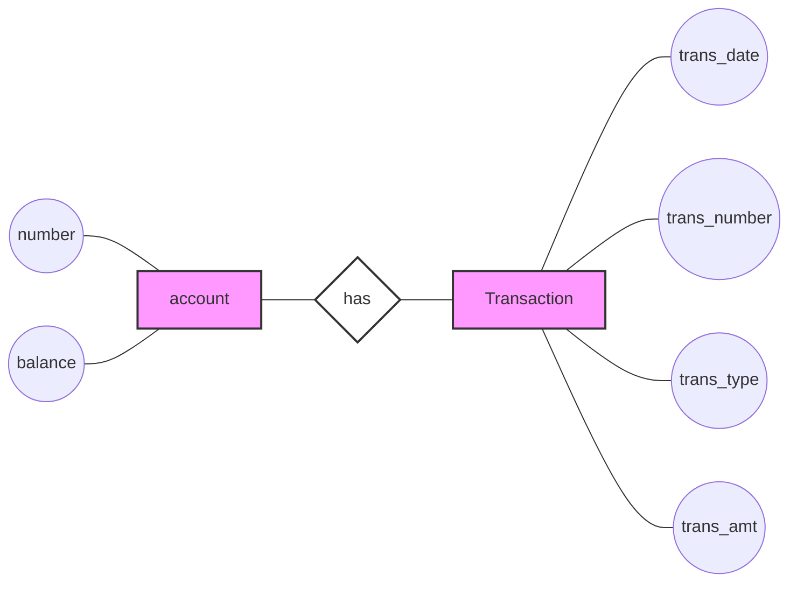
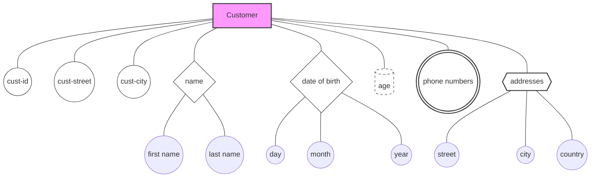
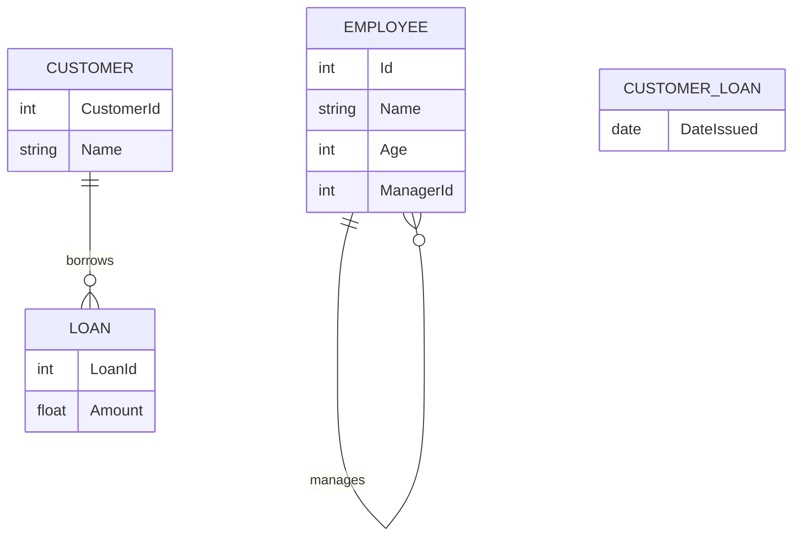

# Entity Types in ERDs: Strong and Weak Entities

In Entity Relationship Diagrams (ERDs), entities can be classified into two main types: strong entities and weak entities. Understanding the difference between these types is crucial for effective database design.

## Strong Entities

### Definition
A strong entity is an entity whose existence does not depend on the existence of any other entity in the system.

### Characteristics
- Can be uniquely identified by its own attributes
- Exists independently of other entities

### Visual Representation
- Single rectangle in ERD

## Weak Entities

### Definition
A weak entity is an entity whose existence depends on the existence of another entity (called the owner or parent entity) in the system.

### Characteristics
- Cannot be uniquely identified by its own attributes alone
- Requires the attributes of its owner entity for unique identification
- Its existence is contingent on the existence of the owner entity

### Visual Representation
- Double rectangle in ERD

## Relationship Between Strong and Weak Entities

### Identifying Relationship
The relationship between a weak entity and its owner (strong) entity is called an identifying relationship.

### Visual Representation
- Double diamond in ERD

## Visual Representation

Here's a visual representation using Chen notation style:

In this diagram:
- Rectangles represent entities ("account" and "Transaction")
- Ovals (approximated by circles) represent attributes
- A diamond shape represents the relationship ("has")

Note: In a full ERD:
- Strong entities would be single rectangles (as shown)
- Weak entities would be double rectangles
- Identifying relationships would be double diamonds
- Primary key attributes would be underlined

## Key Points

1. Strong entities exist independently in the system.
2. Weak entities depend on strong entities for their existence.
3. The relationship between a weak entity and its parent strong entity is an identifying relationship.
4. In ERDs, strong entities are represented by single rectangles, weak entities by double rectangles, and identifying relationships by double diamonds.

## Importance in Database Design

- Understanding entity types helps in properly structuring the database.
- It ensures that dependencies between data are correctly modeled.
- Helps in maintaining data integrity and enforcing proper constraints in the database system.

---

*Note: The visual representation in actual ERD tools may differ slightly from the mermaid diagram shown here, particularly in the representation of weak entities and identifying relationships.*

# Attribute Types in Entity-Relationship Diagrams

In Entity-Relationship Diagrams (ERDs), attributes represent the properties or characteristics of entities. Understanding different types of attributes is crucial for effective database design.

## Types of Attributes

### 1. Simple Attributes
- Definition: Basic, indivisible attributes
- Representation: Single ellipse
- Examples:
  - For Customer entity: cust-id, cust-street, cust-city
  - For Account entity: number, balance

### 2. Composite Attributes
- Definition: Attributes composed of multiple simple attributes
- Representation: Ellipse with connected sub-ellipses
- Examples:
  - Customer name (composed of first name and last name)
  - Date of birth (composed of day, month, year)

### 3. Derived Attributes
- Definition: Attributes whose values can be calculated from other attributes
- Representation: Dashed ellipse
- Examples:
  - Age (calculated from date of birth)
  - Net salary (calculated from salary and deductions)
- Note: Derived attributes are typically not stored in the database to save space. They are handled in application code.
- Trade-off: For complex calculations, it might be more efficient to store the result as a simple attribute to save processing time.

### 4. Multi-valued Attributes
- Definition: Attributes that can have multiple values for a single entity
- Representation: Double ellipse
- Examples:
  - Customer phone numbers
  - Customer addresses

### 5. Complex Attributes
- Definition: A combination of multi-valued and composite attributes
- Representation: Double ellipse with connected sub-ellipses
- Example: Customer addresses, where each address consists of street, city, and country

## Visual Representation

In this diagram:
- Simple attributes: cust-id, cust-street, cust-city
- Composite attributes: name, date of birth
- Derived attribute: age (dashed ellipse)
- Multi-valued attribute: phone numbers (double ellipse)
- Complex attribute: addresses (double ellipse with sub-attributes)

## Considerations in Database Design

1. **Storage Efficiency**: 
   - Simple attributes are straightforward to store
   - Derived attributes often aren't stored to save space
   - Complex attributes may require careful structuring (e.g., separate tables)

2. **Query Performance**: 
   - Simple and stored composite attributes allow for quick queries
   - Derived attributes may require calculation time if not stored

3. **Data Integrity**: 
   - Properly defined attributes help maintain data consistency
   - Multi-valued attributes often necessitate separate tables to maintain normalization

4. **Flexibility**: 
   - Complex and multi-valued attributes provide flexibility for varying data requirements

5. **Trade-offs**: 
   - Consider the balance between storage space and computation time
   - For complex calculations, storing the result as a simple attribute might be more efficient

## Best Practices

1. Use simple attributes when possible for straightforward data storage and retrieval
2. Implement composite attributes when there's a logical grouping of data
3. Carefully consider whether to store or calculate derived attributes based on usage frequency and complexity
4. Normalize multi-valued and complex attributes to maintain data integrity
5. Document the rationale behind attribute choices, especially for derived and complex attributes

---

*Note: The visual representation and implementation of attributes may vary depending on the specific ERD notation and database management system being used.*

# Relationships in Entity-Relationship Diagrams

Relationships in Entity-Relationship Diagrams (ERDs) represent the associations between entities. They are crucial for understanding how different data elements interact within a database system.

## Types of Relationships

Relationships can be classified based on the number of entities involved:

1. **Unary (Recursive) Relationships**
2. **Binary Relationships**
3. **Ternary Relationships**

### 1. Unary (Recursive) Relationships

- Definition: A relationship between instances of the same entity type.
- Representation: A relationship line that connects an entity to itself.
- Example: Employee management hierarchy or employee marriages within a company.

#### Example: Employee Management Hierarchy

Consider the following Employee table:

| Id | Name  | Age | ManagerId |
|----|-------|-----|-----------|
| 1  | Ahmed | 43  | NULL      |
| 2  | Aya   | 37  | 1         |
| 3  | Omar  | 36  | 1         |
| 4  | Mona  | 32  | 2         |

In this example:
- The "Manage" relationship is unary, connecting the Employee entity to itself.
- ManagerId refers back to the Id of another employee, creating a hierarchical structure.

### 2. Binary Relationships

- Definition: A relationship between two different entity types.
- Example: "Customer" borrows "Loan"

### 3. Ternary Relationships

- Definition: A relationship involving three entity types.
- Less common but sometimes necessary to accurately represent complex relationships.

## Relationship Attributes

Some relationships have attributes that only exist when the relationship occurs.

Example: In a "Customer borrows Loan" relationship, "Date Issued" is a relationship attribute.
- It only exists when a loan is actually borrowed by a customer.
- If no customer has taken a loan, there is no "Date Issued".

## Visual Representation

In this diagram:
- The "manages" relationship on EMPLOYEE demonstrates a unary relationship.
- The "borrows" relationship between CUSTOMER and LOAN shows a binary relationship.
- CUSTOMER_LOAN represents the relationship attributes (like DateIssued) that exist only when the relationship occurs.

## Key Points

1. Unary relationships connect an entity to itself, often representing hierarchies or self-referential data.
2. Binary relationships are the most common, connecting two different entity types.
3. Ternary relationships involve three entities and are used for more complex associations.
4. Relationship attributes exist only in the context of the relationship and don't belong to any single entity.

## Considerations in Database Design

1. **Flexibility**: Unary relationships can represent complex hierarchies or networks within a single entity type.
2. **Data Integrity**: Proper relationship modeling ensures referential integrity in the database.
3. **Query Complexity**: More complex relationships (like ternary) may require more sophisticated queries.
4. **Normalization**: Consider how relationships affect database normalization, especially with relationship attributes.

---

*Note: The implementation of relationships in actual databases may vary depending on the specific database management system and the requirements of the application.*
