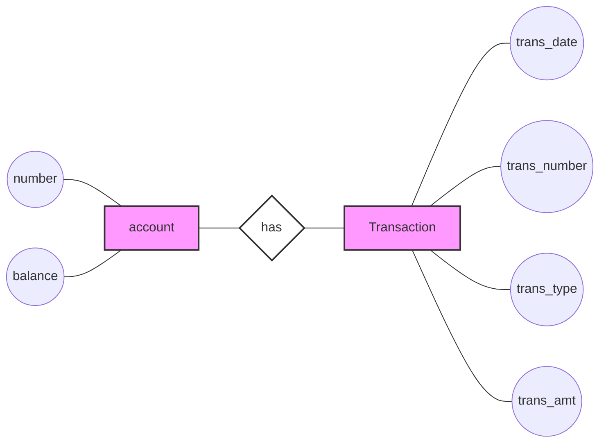

# Entity Types in ERDs: Strong and Weak Entities

In Entity Relationship Diagrams (ERDs), entities can be classified into two main types: strong entities and weak entities. Understanding the difference between these types is crucial for effective database design.

## Strong Entities

### Definition
A strong entity is an entity whose existence does not depend on the existence of any other entity in the system.

### Characteristics
- Can be uniquely identified by its own attributes
- Exists independently of other entities

### Visual Representation
- Single rectangle in ERD

## Weak Entities

### Definition
A weak entity is an entity whose existence depends on the existence of another entity (called the owner or parent entity) in the system.

### Characteristics
- Cannot be uniquely identified by its own attributes alone
- Requires the attributes of its owner entity for unique identification
- Its existence is contingent on the existence of the owner entity

### Visual Representation
- Double rectangle in ERD

## Relationship Between Strong and Weak Entities

### Identifying Relationship
The relationship between a weak entity and its owner (strong) entity is called an identifying relationship.

### Visual Representation
- Double diamond in ERD

## Visual Representation

Here's a visual representation using Chen notation style:

In this diagram:
- Rectangles represent entities ("account" and "Transaction")
- Ovals (approximated by circles) represent attributes
- A diamond shape represents the relationship ("has")

Note: In a full ERD:
- Strong entities would be single rectangles (as shown)
- Weak entities would be double rectangles
- Identifying relationships would be double diamonds
- Primary key attributes would be underlined

## Key Points

1. Strong entities exist independently in the system.
2. Weak entities depend on strong entities for their existence.
3. The relationship between a weak entity and its parent strong entity is an identifying relationship.
4. In ERDs, strong entities are represented by single rectangles, weak entities by double rectangles, and identifying relationships by double diamonds.

## Importance in Database Design

- Understanding entity types helps in properly structuring the database.
- It ensures that dependencies between data are correctly modeled.
- Helps in maintaining data integrity and enforcing proper constraints in the database system.

---

*Note: The visual representation in actual ERD tools may differ slightly from the mermaid diagram shown here, particularly in the representation of weak entities and identifying relationships.*
